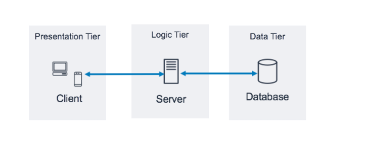
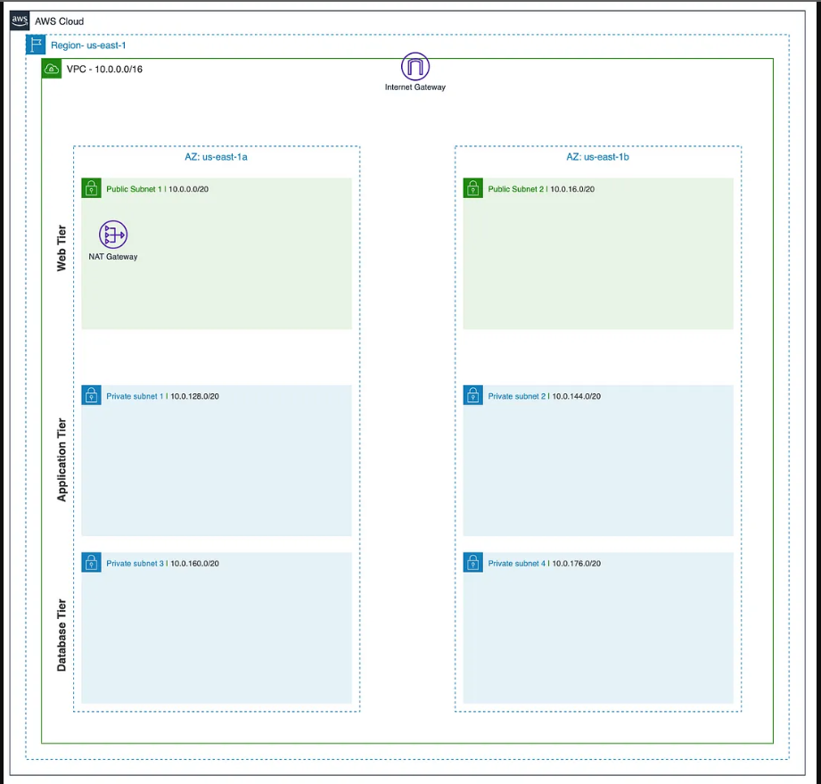
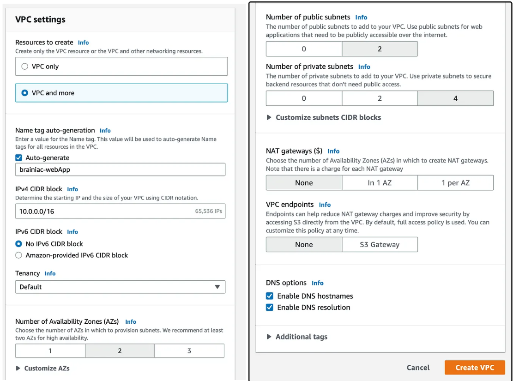
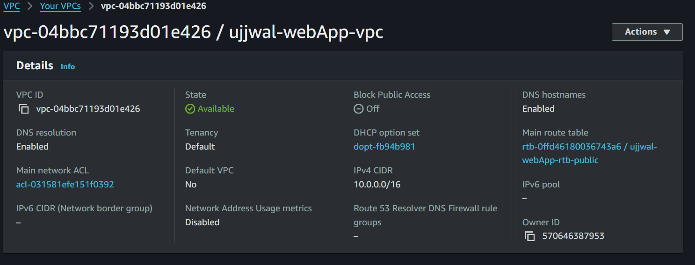
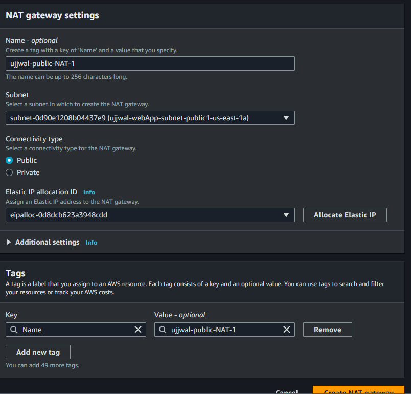
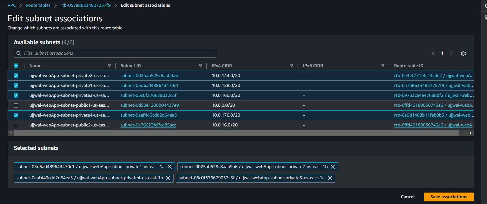
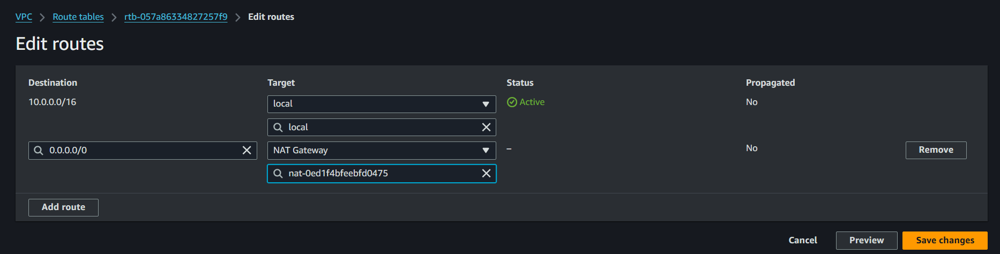

**Amazon VPC 3 Tier Architecture**
https://docs.aws.amazon.com/pdfs/whitepapers/latest/serverless-multi-tier-architectures-api-gateway-lambda/serverless-multi-tier-architectures-api-gateway-lambda.pdf#three-tier-architecture-overview

https://medium.com/@aaloktrivedi/building-a-3-tier-web-application-architecture-with-aws-eb5981613e30

- [x] Amazon vpc(virtual private cloud) 3-tier architecture is a blueprint pattern that divides application components into three layers
    , each and ever layer is hosted in a separate subnet with in a vpc

- [x] When building a cloud based application, architecture is as important as application.
      Architecture in the sence how much our application is scalabe, how its available and how much secure it is.
    * Scalability
    * Availability
    * Security

- [x] **why do we need 3 tier?**
    * 3 tier architecture increases the scalabilty, availability and security by spreading the application into multiple AZs and spreading
        it into 3 layers, each three layers are independent of each other and does perform different task to each other.
    * If an Az does down for some reason, the application has the ability to automatically scale resources to another AZ.

- [x] **3 Layers or 3 tier** (Each tier has its own security gropups that only allows the inbound/outbound traffic needed to perform      specific tasks.)
    * **Web/Presentation Tier:-** It basically contains the user facing elements of the application, such as web servers and the interface/frontend of the application.
    * **Application Tier:-** It contains the backend and application source code which is needed to process data and run the functions.
    * **Data Tier:-** It contains and manages the application data.(Basically where the databases are stored)
    * 

- [x] Creating the base environment upon which our 3 tier application architecture will be built.
    * A VPC
    * 2 Public subnets in two differnet AZs(Web tier)
    * 2 Private subnets in two differnet AZs(Application tier)
    * 2 Private subnets in two differnet AZs(Database tier)
    * 1 Public route table that connects the public subnets to an internet gateway.
    * 1 Private route table that will connect the Application Tier private subnets and NAT gateway  
    * 

- [x] **Building the base architecture**
    * Using VPc console, created the vpc(ujjwa-webApp) 
    * To increase the availabilty of our application, we are using two AZs, two subnets, four private subnets
    * 
    * We need to enable "auto assign public IPV4 address" for Both the public subnets so that its resources can be accessible via internt.
    - [x] **Setting up main route table**
        * When a vpc is created its also creates a route table know as "main table", but we want our public route table to server as main table.
        * 
    - [x] **Creating NAT Gateway**
        * A NAT(Network Address Translation) gateway used to allow instances from the private subnets to connect resources from outside of the vpc and the internet.
        * **Note** : The NAT Gateway itself resides in a public subnet, It has na elastic IP address, which help it to route traffic to and out from the intenet.
        * 
    - [x] **Private Route Tables**
        * By default route table is created for each private subnets by default, in our case its 4.
        * But for Application tier subnets we need only one, so we are taking one private route table and going to associate it with
            all 4 private subnets.
        * 

    - [x] **Have to add a new route to our NAT Gateway in our private route tale**
        * 

        **Now the foundation is complete**

- [x] **Tier 1:Web Tier(Frontend):**
    

