**Amazon VPC 3 Tier Architecture**
https://docs.aws.amazon.com/pdfs/whitepapers/latest/serverless-multi-tier-architectures-api-gateway-lambda/serverless-multi-tier-architectures-api-gateway-lambda.pdf#three-tier-architecture-overview

https://medium.com/@aaloktrivedi/building-a-3-tier-web-application-architecture-with-aws-eb5981613e30

- [x] Amazon vpc(virtual private cloud) 3-tier architecture is a blueprint pattern that divides application components into three layers
    , each and ever layer is hosted in a separate subnet with in a vpc

- [x] When building a cloud based application, architecture is as important as application.
      Architecture in the sence how much our application is scalabe, how its available and how much secure it is.
    * Scalability
    * Availability
    * Security

- [x] **why do we need 3 tier?**
    * 3 tier architecture increases the scalabilty, availability and security by spreading the application into multiple AZs and spreading
        it into 3 layers, each three layers are independent of each other and does perform different task to each other.
    * If an Az does down for some reason, the application has the ability to automatically scale resources to another AZ.

- [x] **3 Layers or 3 tier** (Each tier has its own security gropups that only allows the inbound/outbound traffic needed to perform      specific tasks.)
    * **Web/Presentation Tier:-** It basically contains the user facing elements of the application, such as web servers and the interface/frontend of the application.
    * **Application Tier:-** It contains the backend and application source code which is needed to process data and run the functions.
    * **Data Tier:-** It contains and manages the application data.(Basically where the databases are stored)
    * 

- [x] Creating the base environment upon which our 3 tier application architecture will be built.
    * A VPC
    * 2 Public subnets in two differnet AZs(Web tier)
    * 2 Private subnets in two differnet AZs(Application tier)
    * 2 Private subnets in two differnet AZs(Database tier)
    * 1 Public route table that connects the public subnets to an internet gateway.
    * 1 Private route table that will connect the Application Tier private subnets and NAT gateway  
    * 

- [x] **Building the base architecture**
    * Using VPc console, created the vpc(ujjwa-webApp) 
    * To increase the availabilty of our application, we are using two AZs, two subnets, four private subnets
    * 
    * We need to enable "auto assign public IPV4 address" for Both the public subnets so that its resources can be accessible via internt.
    - [x] **Setting up main route table**
        * When a vpc is created its also creates a route table know as "main table", but we want our public route table to server as main table.
        * 
    - [x] **Creating NAT Gateway**
        * A NAT(Network Address Translation) gateway used to allow instances from the private subnets to connect resources from outside of the vpc and the internet.
        * **Note** : The NAT Gateway itself resides in a public subnet, It has na elastic IP address, which help it to route traffic to and out from the intenet.
        * 
    - [x] **Private Route Tables**
        * By default route table is created for each private subnets by default, in our case its 4.
        * But for Application tier subnets we need only one, so we are taking one private route table and going to associate it with
            all 4 private subnets.
        * 

    - [x] **Have to add a new route to our NAT Gateway in our private route tale**
        * 

        **Now the foundation is complete**

- [x] **Tier 1:Web Tier(Frontend):**
    * Web Tier(Presentation Tier) is the evnironment where our application will be delivered for users to interact with.
    * This is where we will launch our web servers that will host the frontend for our application.
    * In this tier We are going to built this:
        * **Web Server Launch template**: is used to define what kind of EC2 instance will be in our application. 
        * **Auto Scaling Group(ASG)**: That will dynamically scale up or not our EC2 instances according to the demand.
        * **Application Load Balancer(ALB)**: It will guide traffic to its proper targets. 
        * 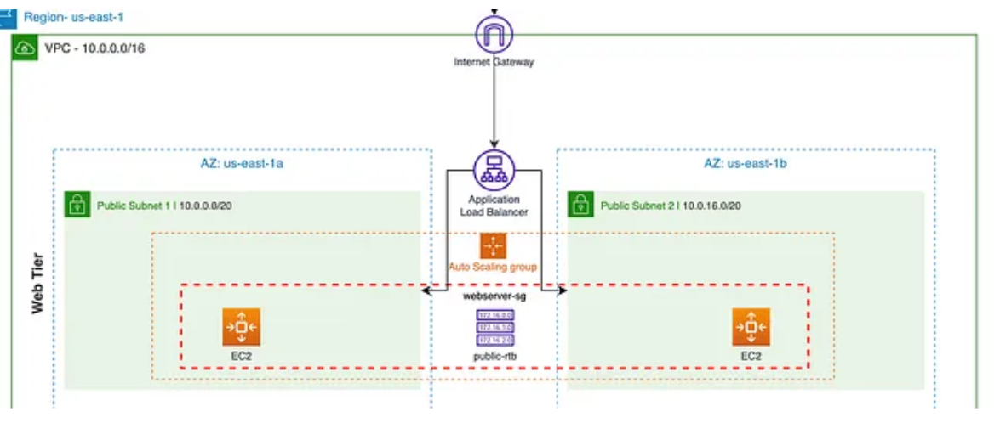
    * Create a web server launch template(This template will help our ASG to dynamically launch EC2 instances)
    * Create an Auto Scaling Group
        * 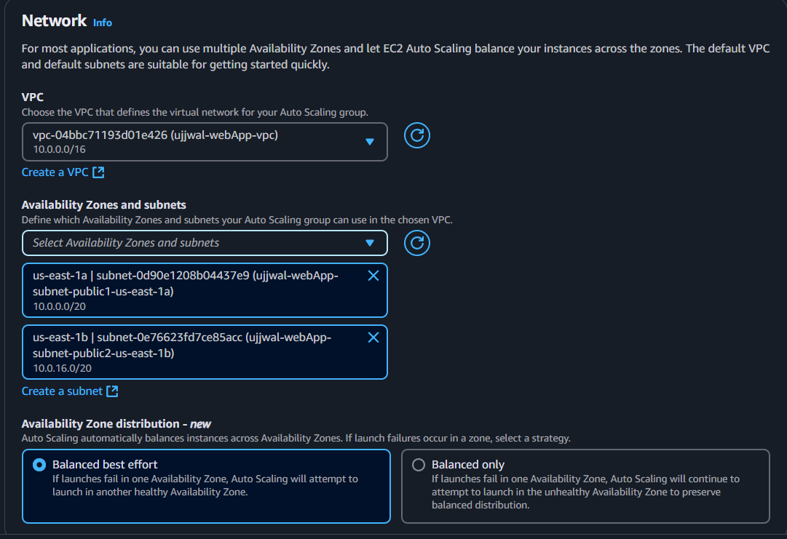
        * we have set Desired Capicity:2, Minimun Capicity: 2 and Maximum Capicity: 5
    * Create Application Load Balancer(ALB)
        * It will distribut the incoming HTTP traffic to the target EC2.
        * It will be internet-facing, so it can listen for both http and https requests.
        * 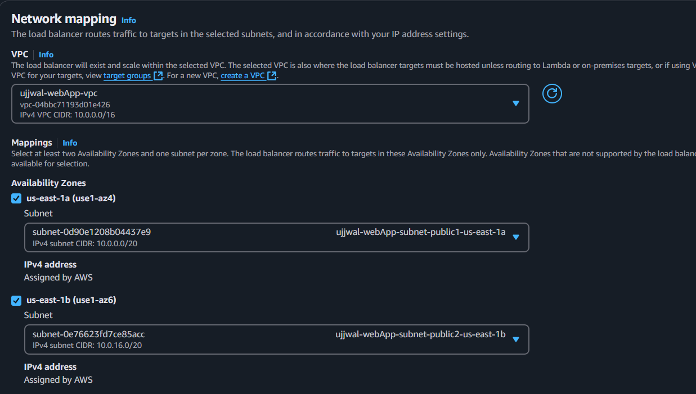
        * 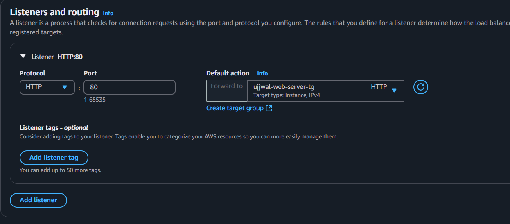
        
    * Everthing is fine till now, out two ec2 instances is launched and running properly
    * To Check everthing is working properly, take loadbalancer DNS and launch it and see the result
        * 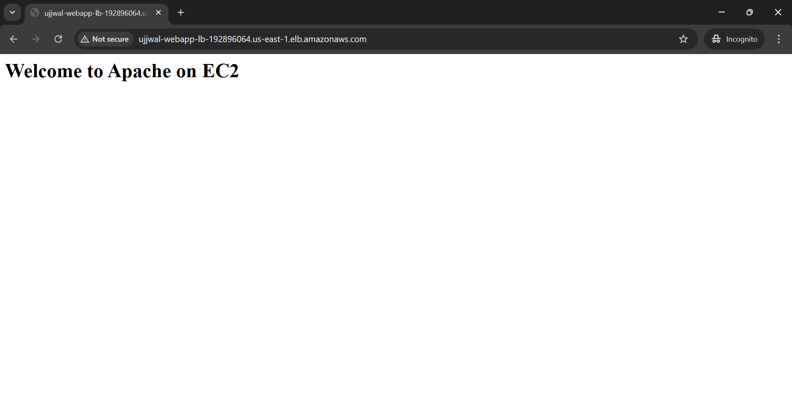
    * Target group should have 2 healthy EC2 instances
        * 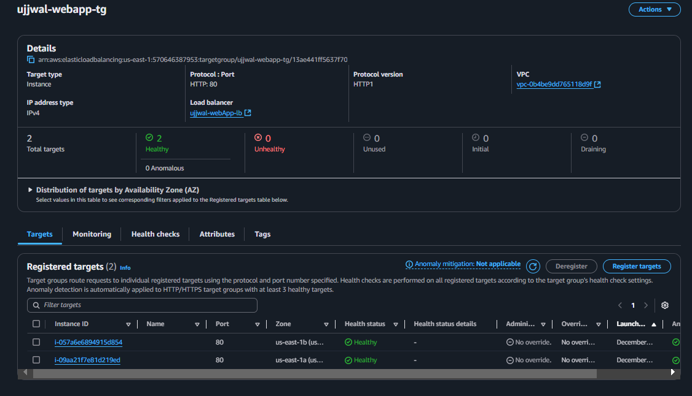

    * Here Web Tier Architecture is completed for ujjwal-webApp

- [x] **Tier2: Application Tier(Backend):**
    * Application Tier is where the source code and core operations like send/retrieve data to/from the web and the Database tier
    * In this tier we are going to built
        * Launch Template
        * Auto Scaling Group
        * Application Load Balancer
        * A Bastion Host(to securely connect to our application servers)
        * 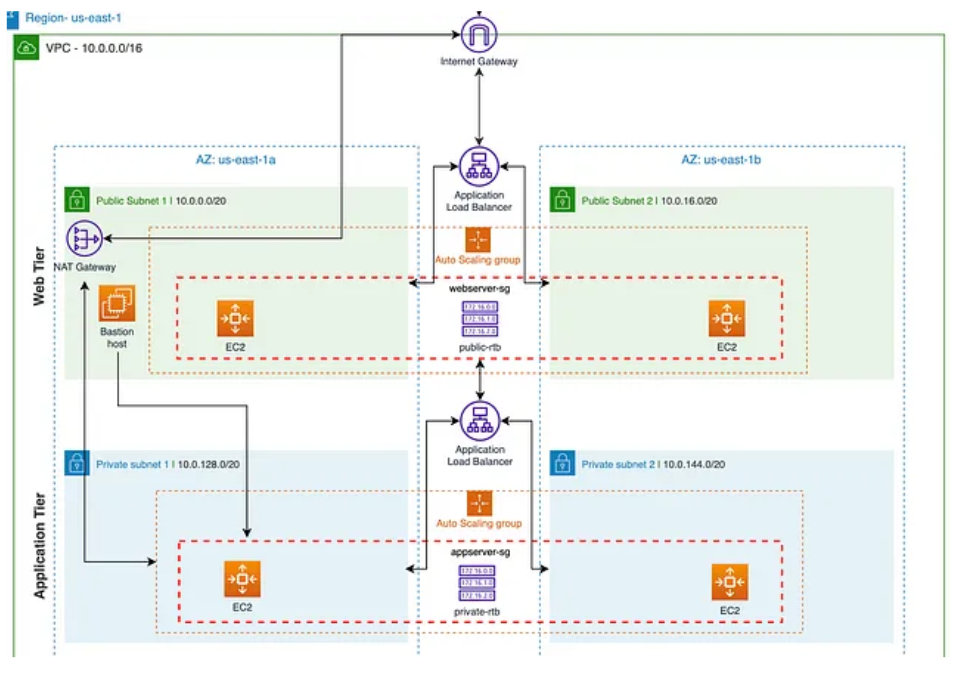

    * Creating an Application server Launch Template
        * This is basically defines that which type of EC2 instances are going to be used by our backend services.
        * For this template we need to take some precuations so that it can't be accessible from the outside because its a private subnet, where all our application source code will live.
        * We are allowing **ICMP–IPv4**, which allows us to ping the application server(application tier) from the web server. 

    * Creating an Auto Scaling Group
        * We have to attach two private subnets with this security group(private-1, private-2)   
        * 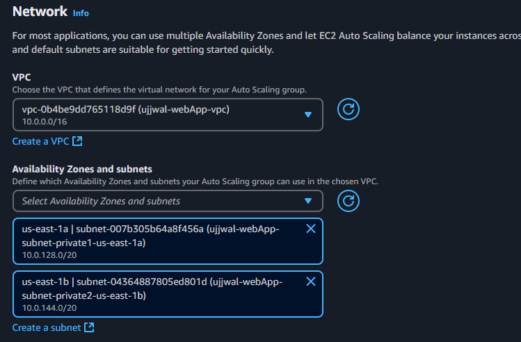
    
    * Creating Application load balancer
        * We are creating this to route the traffic from web Tier to this application tier
        * This time we are configuring it as Internal beacuse we are routing traffic from web tier not from the internet

    * After all this now we have 4 running instances: 2 in web tier and 2 in application tier
        * 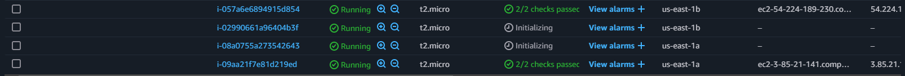

    * To check the connection ssh into web tier instance and ping the app tier private ip instance
        * 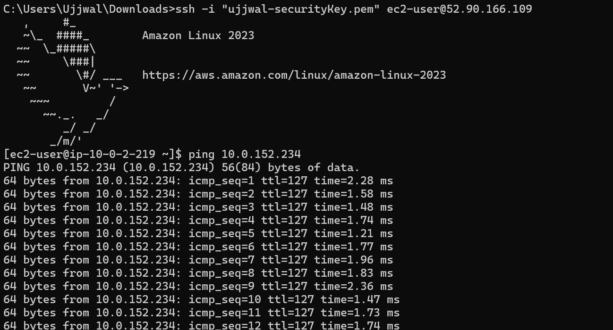

    * Creating a Bastion Host
        * A Bastion host is a dedicated server used to securily access a private network from a public network
        * To Protect our application tier from outside access, so we will create an ec2 instance in the webTier outside the ASG.
            SO this ec2 instance will be our only server that will be used as a gateway to our app servers.
        * Successfully connect with bastion host 
            * 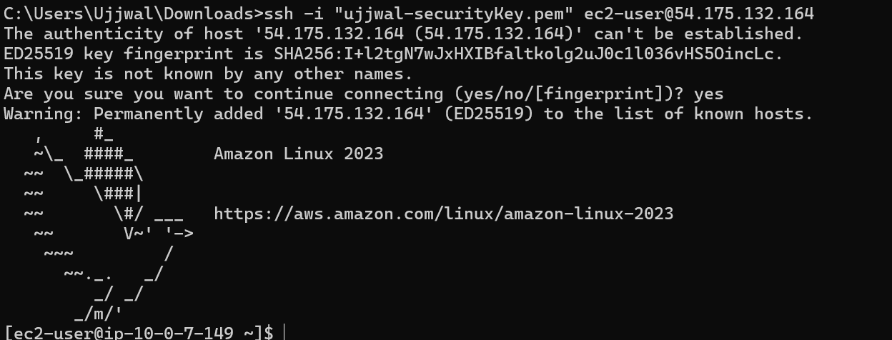
    * now the application tier is created Successfully

- [x] Tier3: **Database tier(Data Storage & retrieval)
    * **What is DynamoDb:** 
        * There are several types of non-relational databases like- documents stores, which stores semi-structured and 
        unstructured data in the from of files. Key-value databases store unstructured data in the form of Key-value pairs. DynamoDb
        combines the best of those two non-relational databases to form a great non-realtional service. 
        * DynamoDb automatically scales up and down to adjust for capacity and maintain performanace. 
        * DynamoDb charges for reading, writing, and storing data along with any optimal features.
            * Dynamo Db has two capacity mode:
                * Provisioned mode
                * On-demand mode
                

          

